# Quant AI Market Lab

I built Quant AI Market Lab as an independent research project while moving from mathematics and computer and system sciences into quantitative finance. My master's studies in Mathematics and Computer and System Sciences trained me to reason about probability, algorithms, and optimization. Here I apply those tools to market data while learning the finance needed to judge what the results actually mean.

> **Project status (26 September 2026):** The first quantitative research version is complete. It covers validated market data, return and covariance analysis, PCA, market-condition modeling, SPY risk forecasting, chronological evaluation, minimum-variance portfolio optimization, retrospective backtests, benchmarks, costs, and subperiod checks. The code and results are a historical research exercise, not a live strategy. Further features are listed below as optional extensions.

## Motivation

I wanted to work through a quantitative research problem from the data stage to the numerical results, rather than study each method in isolation. I began with historical prices, examined returns and relationships between assets, and then moved to market-condition models, risk forecasts, and minimum-variance portfolios.

The mathematics and algorithms give me a way to formulate each problem and check whether the computation makes sense. Finance is a newer application area for me, so I have used published references, documentation, online resources, and AI tools to learn relevant concepts and help organize the work. I document the methods I use, the reasoning behind my experiments, the numerical checks, and the limits of what the results can tell me. I cite external methods and sources in the project references.

## Asset Universe

I use eight exchange-traded funds (ETFs) to work with different market exposures:

- SPY — U.S. large-cap equities
- QQQ — Nasdaq-100 equities
- IWM — U.S. small-cap equities
- TLT — long-term U.S. Treasury bonds
- GLD — gold
- USO — oil-futures exposure
- EEM — emerging-market equities
- VNQ — U.S. real estate

I download adjusted prices through `yfinance` (Yahoo Finance data). The data-ingestion configuration requests observations from `2015-01-01` through `2026-09-01`, with the end date excluded. The validated dataset used for the reported results contains trading dates from `2015-01-02` through `2026-08-31`.

## Completed Work

### 1. Market Data Pipeline

I started by building a common price dataset for the eight ETFs. The pipeline includes:

- historical adjusted-price data acquisition
- cross-asset dataset validation
- missing-value and finite-value checks
- local raw-data storage separated from version-controlled source code

I check that the observations are in chronological order and that the adjusted prices are finite and positive before using them in later calculations. This gives me a clear starting point for the rest of the project.

### 2. Return Transformation

I calculate both simple and logarithmic returns from the adjusted prices.

For prices $P_t$,

$$
R_t = \frac{P_t}{P_{t-1}} - 1,
$$

and

$$
r_t = \log\left(\frac{P_t}{P_{t-1}}\right).
$$

I use the mathematical relationship between them as a numerical check. The implementation verifies

$$
r_t = \log(1+R_t)
$$

within numerical tolerance.

This is an example of how I approach the project: rather than accepting a computed column because the code runs, I check it against an identity that the calculation should satisfy.

### 3. Exploratory Cross-Asset Analysis

Before fitting models, I wanted to see how the assets behaved in the available sample. I examined:

- normalized historical asset performance
- annualized historical volatility
- cross-asset return correlations
- numerical validation of correlation-matrix properties

I use basic statistical ideas here to compare the assets on common scales and to look at their historical variation and co-movement. These plots describe the observed sample; they do not by themselves predict what the assets will do next.


### 4. Covariance Analysis

I construct the sample covariance matrix of daily log returns and check that it is symmetric and positive semidefinite within numerical tolerance.

For a portfolio-weight vector $w$, portfolio return variance is represented by

$$
\mathrm{Var}(r_p)=w^\top\Sigma w.
$$

My background in linear algebra and quadratic forms helps me connect this matrix calculation to the portfolio problem later in the project. I first check the properties of the covariance matrix, then use it as an input to minimum-variance portfolio optimization.

### 5. Principal Component Analysis

I was familiar with covariance matrices, eigenvalues, and eigenvectors from mathematics. Here I use them to study how the returns of the eight ETFs move together. I standardize the cross-asset log returns and apply PCA to examine directions of variation without allowing differences in individual return scales to dominate the calculation.

In the current sample:

- PC1 explains approximately **50.53%** of standardized return variation.
- The first two components explain approximately **66.93%**.
- The first three components explain approximately **79.01%**.

I check eigenvector orthogonality, agreement between the sum of the eigenvalues and the matrix trace, and the explained-variance ratio. These checks help me confirm that the numerical eigendecomposition behaves as expected.


I interpret the first component cautiously as a broad equity/risk co-movement direction in this historical sample. I do not treat it as a proven causal economic factor.


## Market-Regime Analysis

### Temporal Research Split

For the later predictive experiments, I divide the return observations chronologically at `2026-04-30`.

The historical period contains **2,847 return observations**, while the later May-August 2026 period contains **84 observations**.

I have already examined the later period during project development. For that reason, I describe it as a **fixed-cutoff temporal or pseudo-out-of-sample evaluation period**, not as a completely untouched holdout. I keep this distinction explicit when discussing the results.

### Regime Features

I use three features to describe each trading day's market conditions:

$$
x_t =
\begin{pmatrix}
r_{\mathrm{SPY},t} \\
\sigma_{\mathrm{SPY},t}^{(20)} \\
d_t
\end{pmatrix},
$$

where the coordinates are:

- SPY daily log return
- backward-looking 20-trading-day SPY volatility
- daily cross-asset return dispersion across the eight ETFs

I first examine the geometry of this three-dimensional feature space through pairwise projections. My aim is to see the shape of the observed data before asking a clustering algorithm to divide it into groups.

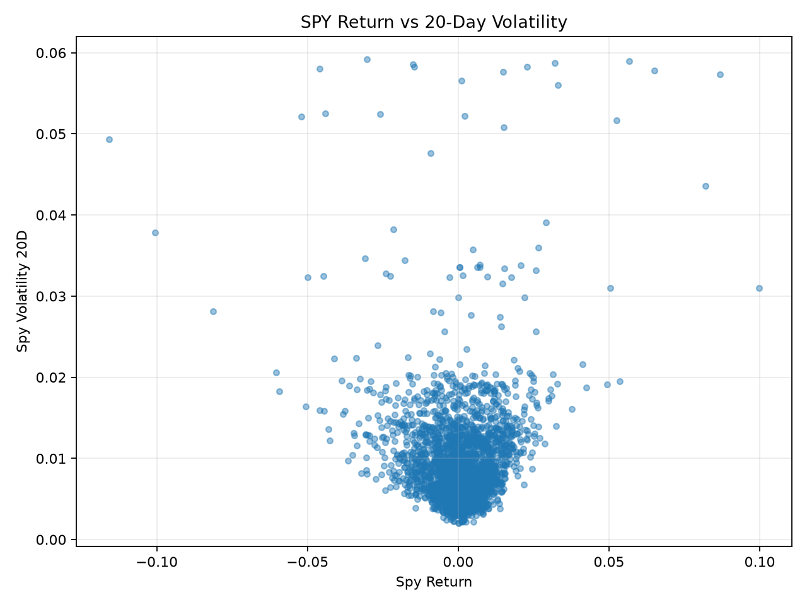

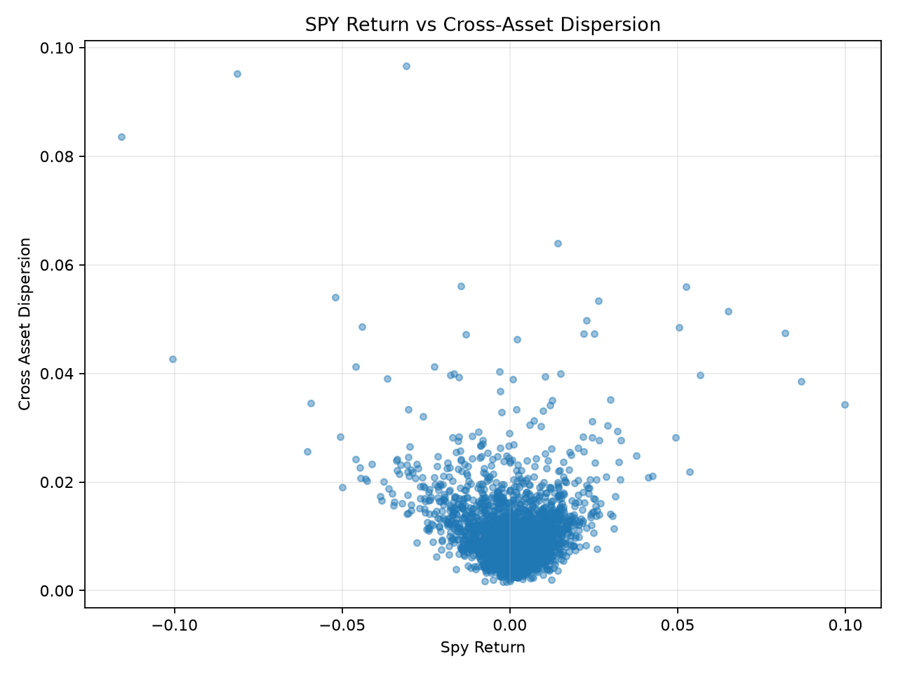

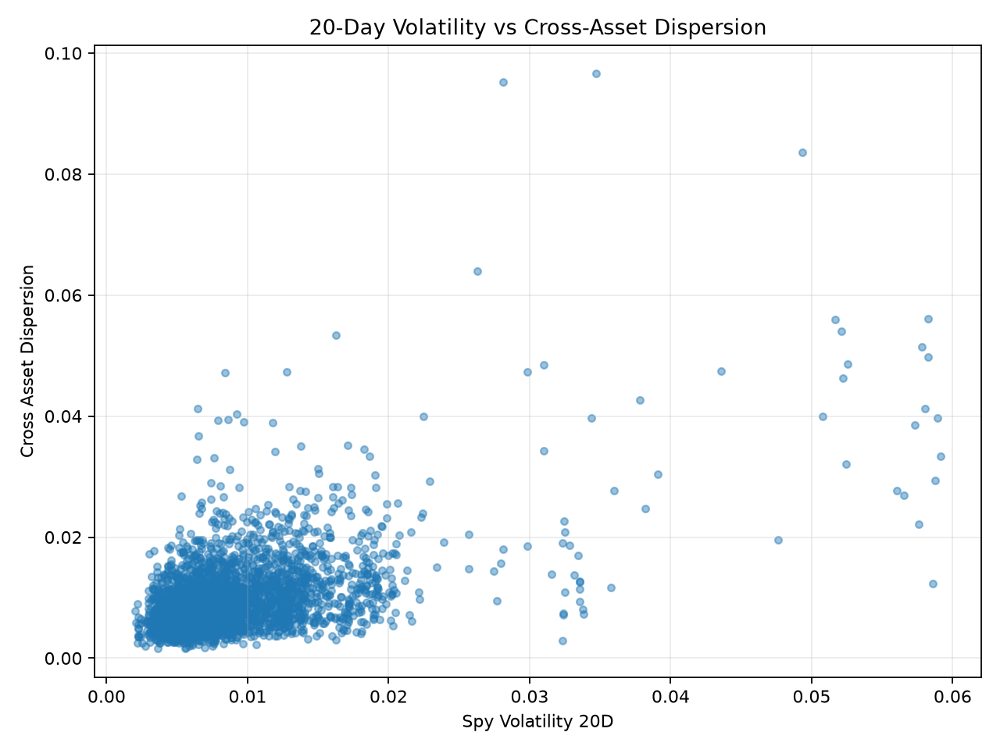

The observations form a dense central region with asymmetric tails rather than obviously separated compact groups. I therefore use clustering as a statistical partition of the data, not as proof that naturally separated economic regimes exist.

### KMeans Baseline

KMeans gives me a geometric starting point for examining the feature space. Because the three features have different numerical scales, I standardize them before fitting the model. That matters because KMeans measures Euclidean distances between observations and centroids.

For $K$ clusters, KMeans minimizes

$$
\sum_{k=1}^{K}
\sum_{z_t \in C_k}
\|z_t-\mu_k\|_2^2.
$$

I compare candidate values from $K=2$ through $K=8$ using inertia, silhouette score, cluster sizes, and initialization stability.

Among these candidates, $K=2$ produces the largest silhouette score. The baseline contains:

- **Cluster 0:** 309 observations (approximately **10.93%**)
- **Cluster 1:** 2,519 observations (approximately **89.07%**)

The smaller cluster has, on average, more negative SPY returns, higher recent SPY volatility, and higher cross-asset dispersion. I describe these as **stress-like statistical characteristics**, not as proof of a causal economic regime.

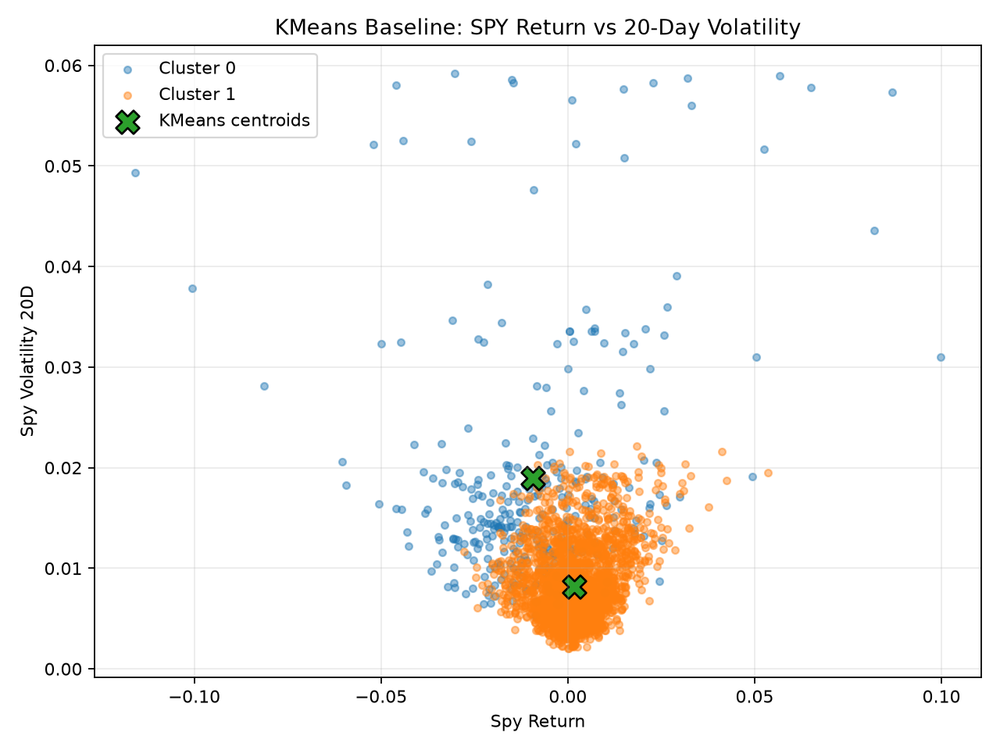

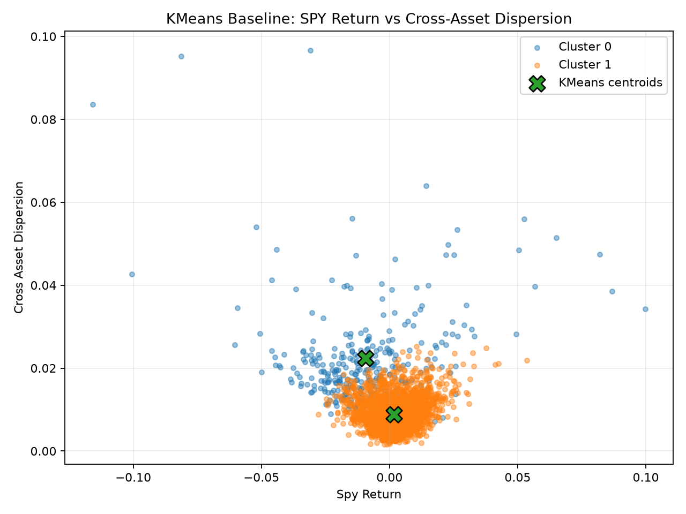

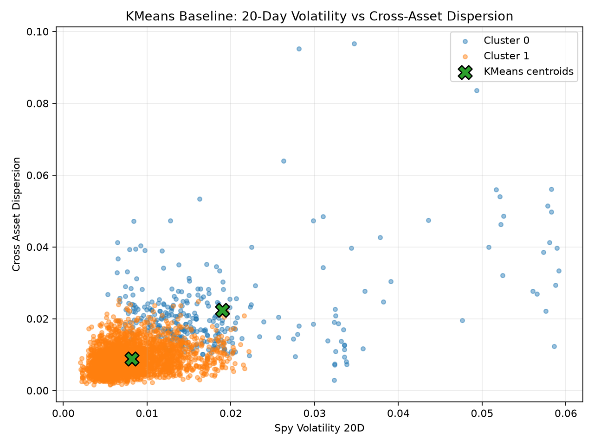

In these plots, the colors distinguish Cluster 0 and Cluster 1, and the `X` markers show the KMeans centroids.

### 3-D Geometric Comparison

I also compare the same KMeans assignments in the original financial coordinates and in the standardized coordinates used for fitting.

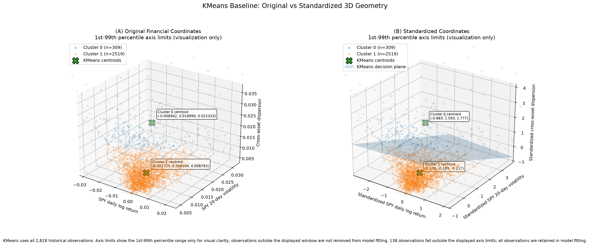

The left panel keeps the original financial units. The right panel shows the standardized feature space, where KMeans computes Euclidean distances, together with the equal-distance decision plane between the two centroids. I use the 1st-99th percentile range for the display axes only; all 2,828 historical observations remain part of model fitting.

### Temporal Diagnostics

KMeans uses the geometry of the feature space but does not use chronological dependence when fitting. I therefore examine the cluster assignments afterward as a sequence through time.

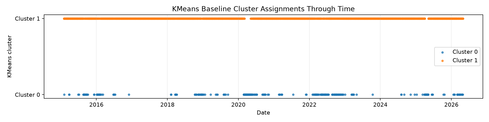

The larger cluster is substantially more persistent, while the smaller cluster often occurs in shorter bursts.

This limitation led me to compare KMeans with a model that represents transitions and persistence directly: a Hidden Markov Model (HMM).

I keep KMeans as a **reproducible geometric baseline**. Its output does not show that the market has exactly two genuine persistent regimes.

### Hidden Markov Model Temporal Analysis

My probability background gives me a starting point for understanding Markov transitions, conditional distributions, and likelihood. I use Gaussian Hidden Markov Models (HMMs) on the same three standardized market-condition features to examine temporal dependence as well as the observed feature values.

I first fit a two-state full-covariance HMM as a simple temporal baseline. Its decoded historical states contain **1,853** and **975**
observations, with expected durations of approximately **61.1** and
**32.1 trading observations**.

The two-state HMM changes decoded state **54 times** over the historical sequence, compared with **348 KMeans cluster switches**. I do not take this difference alone as evidence that the HMM is automatically superior: the HMM explicitly models state persistence, while KMeans does not.

For more detailed interpretation, I retain a **three-state full-covariance Gaussian HMM** as the primary specification. Its decoded historical state proportions are approximately:

- **48.69%** — lower-volatility / lower-dispersion conditions
- **38.72%** — intermediate-volatility / intermediate-dispersion conditions
- **12.59%** — higher-volatility / higher-dispersion, stress-like conditions

The corresponding expected durations are approximately **45.6**,
**24.7**, and **13.5 trading observations**.

I compare HMMs with two through six states and both diagonal and full covariance structures. The comparison includes multiple initializations, likelihood, AIC/BIC, chronological validation, rolling-origin validation, Viterbi occupancy, and posterior state probabilities.

Models with more states continue to improve likelihood, but they increasingly introduce small or period-specific latent components. I retain the three-state full-covariance model as a **parsimonious and interpretable specification**, not because the results prove that financial markets contain exactly three true regimes. I also keep retrospective decoded states separate from states that would have been available in real time.

I use the later May-August 2026 period for fixed-cutoff temporal evaluation of the retained HMM. Since I have already examined this period during development, I treat the results as retrospective pseudo-out-of-sample evidence rather than an untouched holdout.


## Risk Forecasting: Linear and Nonlinear Models

I define the forecasting target at date $t$ as the root mean square (RMS) of SPY daily
log returns over the next five trading days. I keep the same target,
feature definitions, and chronological validation dates when comparing
different forecasting methods.

The three current market features are:

- current SPY log return
- trailing 20-day SPY volatility
- same-day cross-asset return dispersion

I first compared simple historical baselines with Ridge regression.
I then added Random Forest as a nonlinear alternative. Its depth and
minimum-leaf-size settings were selected using chronological folds
inside the training period rather than using the outer historical
validation period.

On the common 565-date historical validation period:

| Method | MAE | RMSE |
| --- | ---: | ---: |
| Constant baseline | 0.003597 | 0.005924 |
| Rolling 20-day RMS | 0.003613 | 0.006217 |
| Ridge, alpha = 1 | 0.003201 | 0.005386 |
| Random Forest | 0.003443 | 0.005982 |

Ridge had lower MAE and RMSE than Random Forest in this historical
comparison. Random Forest still improved on the simple baselines in
MAE. I treat these as results for this dataset, target, and evaluation
period rather than evidence that one model will generally dominate the
other.

### Ridge coefficient stability

For the rolling 504-observation Ridge specification, I examined the
standardized coefficients across 87 monthly refits from 2019-02-08 to
2026-04-01.

The SPY-return coefficient remained negative in all 87 refits, while
the trailing-volatility and cross-asset-dispersion coefficients remained
positive. Their magnitudes changed over time.

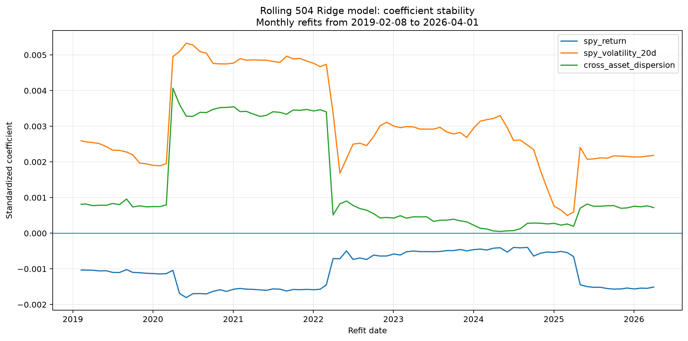

### Linear and nonlinear prediction geometry

With SPY return fixed at its median training value, I vary SPY
20-day volatility and cross-asset dispersion to visualize a
two-feature slice of each fitted model.

The Ridge model produces a plane, reflecting its linear structure.

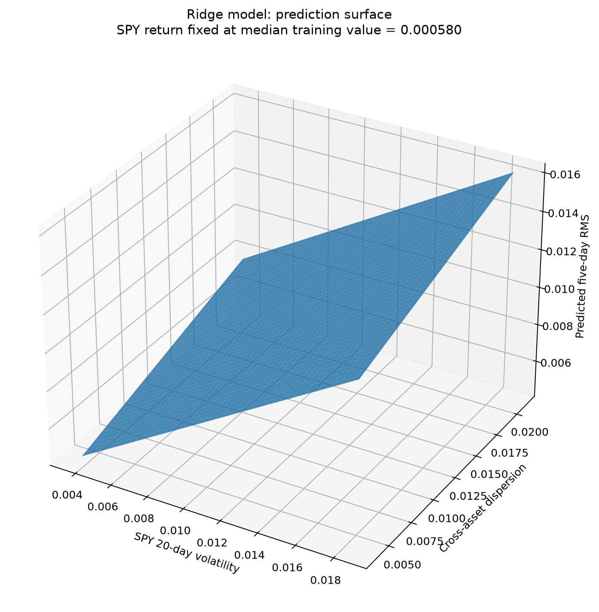

The Random Forest produces a piecewise nonlinear surface because its
trees partition the feature space into regions.

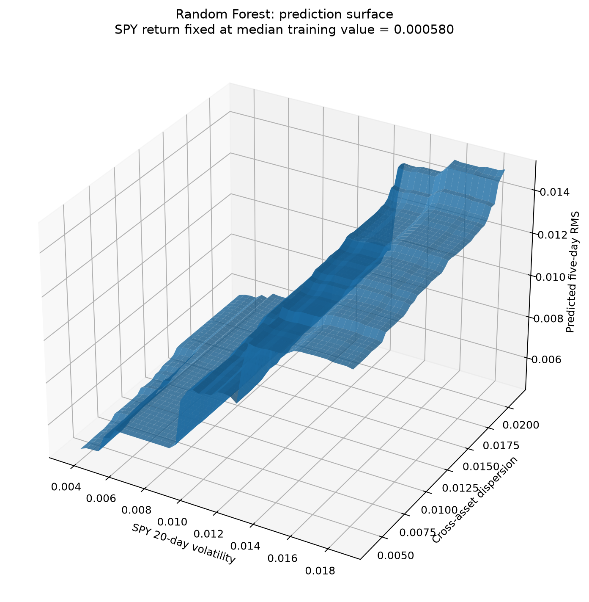

One fitted tree from the 100-tree forest is shown only to depth 3 so
that the splitting logic remains readable. It is an illustration of
one estimator, not a representation of the whole forest.

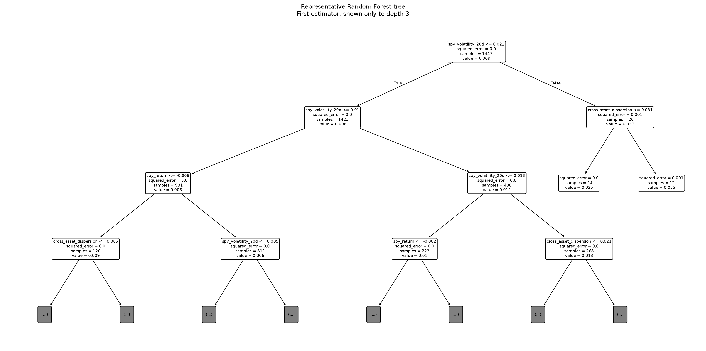

### Random Forest permutation importance

I also measured permutation importance on the same historical
validation period. Each feature was permuted 50 times while measuring
the increase in MAE.

| Feature | Mean increase in MAE | Standard deviation |
| --- | ---: | ---: |
| SPY 20-day volatility | 0.000624 | 0.000078 |
| SPY return | 0.000143 | 0.000043 |
| Cross-asset dispersion | -0.000005 | 0.000012 |

The fitted forest relied most strongly on recent SPY volatility in
this validation sample. Permuting cross-asset dispersion did not
measurably worsen MAE. I do not interpret permutation importance as a
causal measure, and correlated features can share predictive
information.

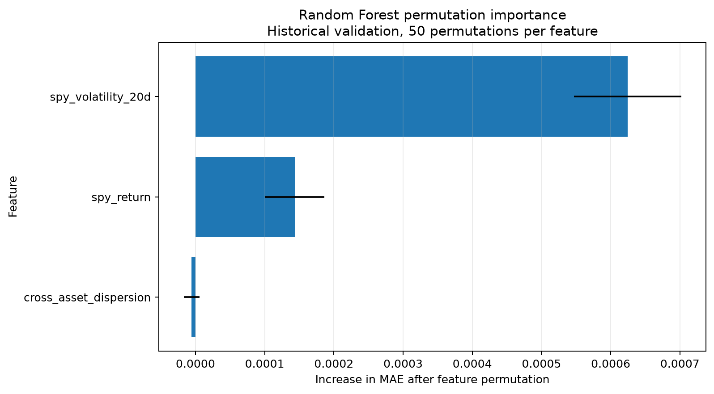

Detailed forecasting notes are in:

- `docs/ridge_risk_forecasting.md`
- `docs/ridge_alpha_validation.md`
- `docs/walk_forward_window_selection.md`
- `docs/random_forest_risk_forecasting.md`


## Portfolio Optimization and Historical Backtest

I use the eight ETFs to ask a separate question: how do different covariance estimation windows affect a long-only minimum-variance portfolio? The optimizer chooses weights that sum to one and minimize estimated variance. I compare rolling windows of 252, 504, 756, and 1008 trading observations with an expanding window. I then compare them with equal-weight buy-and-hold, monthly equal-weight, and SPY buy-and-hold.

The portfolio backtest uses data through **30 April 2026**, makes 87 month-end decisions from January 2019 to March 2026, and trades at the next session's close in the simulation. Its 1,820 daily return observations run from February 2019 through April 2026. The later May–August 2026 period discussed elsewhere is for SPY risk-forecast evaluation; it is **not** an untouched portfolio holdout. I have examined these portfolio results during development, so the comparisons are retrospective.

At zero modeled transaction cost, 100,000 nominal accounting units grew to:

| Historical method | Final value |
| --- | ---: |
| Minimum variance, rolling 252 | 200,065.77 |
| Minimum variance, rolling 504 | 204,323.60 |
| Minimum variance, rolling 756 | 208,357.79 |
| Minimum variance, rolling 1008 | 205,073.73 |
| Minimum variance, expanding | 195,766.86 |
| Equal-weight buy-and-hold | 228,956.45 |
| Equal-weight monthly | 236,838.19 |
| SPY buy-and-hold | 296,706.25 |

The minimum-variance methods aim to reduce estimated variance, not to maximize return. In this sample, the benchmarks finished with higher values at zero cost. In the four reported subperiods at a 10-basis-point cost assumption, the minimum-variance portfolios had lower realized annualized volatility than the three benchmarks. These are observations about this sample, not a rule for future markets. I also compare 0, 5, and 10 basis points per unit of traded notional and check turnover, transaction expense, and subperiod accounting.

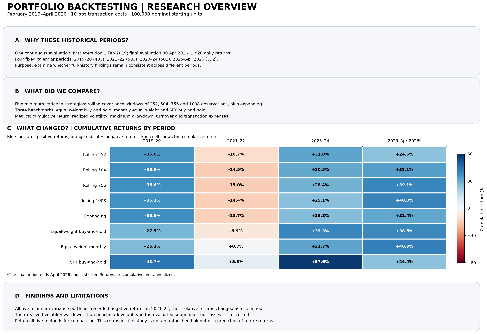

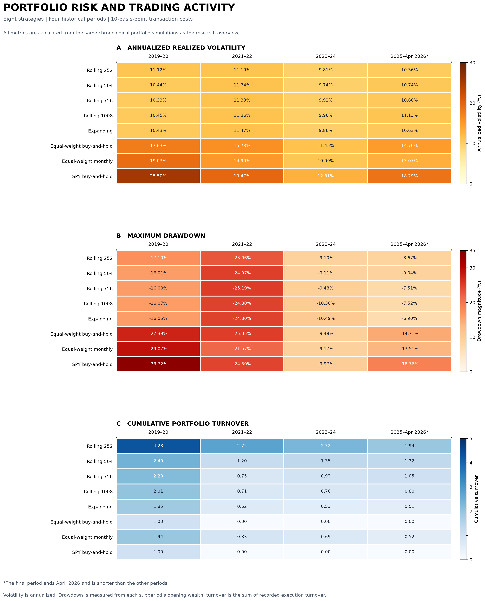

The [portfolio methods and validation](docs/portfolio_mathematics_and_validation.md) explain the objective, timing, accounting, numerical checks, and limitations. The [subperiod findings](docs/portfolio_robustness_findings.md) show where the comparisons vary across time. The nominal units do not represent an INR account.

## Mathematical, Algorithmic, and Systems Foundations

I use several parts of my mathematics, algorithms, and computer-science
background together rather than treating the project as a collection of
unrelated machine-learning models.

| Foundation | How I use it in this project |
| --- | --- |
| Probability and statistics | return distributions, volatility, covariance, HMM transitions, likelihood, forecast-error analysis |
| Linear algebra | covariance matrices, quadratic forms, PCA, eigenvalues and eigenvectors |
| Convex optimization | Ridge regression and minimum-variance portfolio optimization |
| Geometry | PCA directions, standardized regime-feature space, KMeans decision geometry, prediction surfaces |
| Algorithms | clustering, tree-based partitioning, chronological model selection, walk-forward procedures |
| Numerical analysis | tolerance checks, matrix-property validation, prediction reconstruction, reproducibility checks |
| Time-series reasoning | chronological splits, observable-target constraints, rolling and expanding windows, look-ahead prevention |
| Scientific computing | NumPy, pandas, SciPy/scikit-learn, CVXPY, reproducible Python pipelines |
| Systems and software practice | modular source code, Conda environments, Git versioning, documented scripts and reproducible outputs |

My aim is to make the mathematical assumptions, implementation choices,
validation rules, and limitations visible enough that the results can
be questioned and reproduced rather than treated as black-box output.


## Mathematical and Algorithmic Documentation

I keep a separate technical document for the mathematics and algorithms behind the implementation, so that the README can explain the research without hiding the details needed to reproduce or question it. The document covers:

- data and return representations
- statistical estimators
- volatility and dependence measures
- covariance-matrix properties
- PCA formulation and eigendecomposition
- numerical validation
- computational complexity
- scalability considerations
- predictive-modeling and look-ahead-bias caveats

See:

`docs/mathematics_optimization_algorithms.md`

For example, covariance construction for $T_R$ return observations and $n$ assets scales approximately as

$$
O(T_R n^2),
$$

while a full dense eigendecomposition scales approximately as

$$
O(n^3).
$$

These computations are small for my current eight-asset universe. I still document their complexity because I want to understand what would change if I worked with more assets or a larger dataset.

## Repository Structure

```text
quant-ai-market-lab/
├── data/
│   ├── raw/        # local, ignored by Git
│   └── processed/  # local, ignored by Git
├── docs/
│   ├── hmm_fixed_cutoff_evaluation.md
│   ├── mathematics_optimization_algorithms.md
│   ├── portfolio_mathematics_and_validation.md
│   ├── portfolio_robustness_findings.md
│   ├── random_forest_risk_forecasting.md
│   ├── references.md
│   ├── ridge_alpha_validation.md
│   ├── ridge_risk_forecasting.md
│   ├── risk_forecasting_baselines.md
│   └── walk_forward_window_selection.md
├── models/         # local model artifacts, ignored by Git
├── notebooks/      # local workspace directory
├── results/
├── src/
│   ├── adaptive_window_selection.py
│   ├── april_2020_ridge_diagnostic.py
│   ├── compute_returns.py
│   ├── download_data.py
│   ├── exploratory_analysis.py
│   ├── final_model_visualizations.py
│   ├── later_forecast_plot.py
│   ├── later_walk_forward_comparison.py
│   ├── later_walk_forward_evaluation.py
│   ├── pca_analysis.py
│   ├── portfolio_backtest.py
│   ├── portfolio_benchmarks.py
│   ├── portfolio_optimization.py
│   ├── portfolio_risk_visualization.py
│   ├── portfolio_robustness.py
│   ├── portfolio_visualization.py
│   ├── regime_clustering.py
│   ├── regime_features.py
│   ├── regime_hmm.py
│   ├── regime_hmm_evaluation.py
│   ├── random_forest_permutation_importance.py
│   ├── random_forest_risk_forecasting.py
│   ├── random_forest_validation.py
│   ├── ridge_alpha_validation.py
│   ├── ridge_coefficient_stability.py
│   ├── ridge_risk_forecasting.py
│   ├── risk_forecast_comparison.py
│   ├── risk_forecasting.py
│   ├── risk_full_history_plot.py
│   ├── temporal_split.py
│   ├── walk_forward_comparison.py
│   ├── walk_forward_dates.py
│   ├── walk_forward_evaluation.py
│   └── walk_forward_ridge.py
├── .gitignore
├── README.md
└── requirements.txt
```

## Reproducibility

My development environment uses:

- Python 3.12
- Conda environment: `quant-ai`

I keep the current Python dependency snapshot in:

`requirements.txt`

Raw and processed market datasets are intentionally excluded from Git version control. From the repository root, the following commands install the recorded dependency snapshot and rebuild the inputs for the core analysis:

```bash
conda create -n quant-ai python=3.12 -y
conda activate quant-ai
python -m pip install -r requirements.txt
python -m src.download_data
python -m src.compute_returns
python -m src.exploratory_analysis
python -m src.pca_analysis
python -m src.portfolio_optimization
python -m src.portfolio_backtest
python src/portfolio_benchmarks.py
python src/portfolio_robustness.py
```

The benchmark and robustness scripts currently use direct-file imports, which is why those last two commands use `python src/...` instead of `python -m src...`. Other analyses have their own scripts and methods notes under `src/` and `docs/`. The pinned requirements record my development environment; a fresh download may differ from the historical dataset if the provider revises adjusted prices. These instructions reconstruct the pipeline and do not promise identical numerical results from a revised data snapshot.

## Completed Research and Remaining Development

So far, I have implemented market-data validation, return and covariance analysis, PCA, market-regime modeling, SPY risk forecasting, chronological walk-forward evaluation, minimum-variance portfolio optimization, historical backtesting, benchmark comparisons, transaction-cost analysis, and subperiod robustness testing.

I document the portfolio formulation, execution assumptions, validation checks, historical results, and limitations in:

`docs/portfolio_mathematics_and_validation.md`

I document the subperiod findings in:

`docs/portfolio_robustness_findings.md`

The core quantitative-research workflow is now implemented, including
linear and nonlinear risk forecasting, chronological model selection,
model interpretation, regime analysis, portfolio optimization,
walk-forward backtesting, transaction costs, and robustness analysis.

This is the completed scope of the first quantitative research version.
The retrospective results and execution assumptions remain visible so a
reader can question them or rerun the analysis.

I am deliberately leaving the following as optional future extensions:

1. local generative-AI-assisted quantitative reporting
2. an interactive Streamlit research dashboard
3. broader predictive-model experiments beyond the current Ridge and
   Random Forest comparison

These extensions are not required for the current quantitative-research
version of the project.

## Research and Validation Principles

I try to approach each part of the project in the same way:

- formulate the mathematical problem before implementing it
- check computed quantities against mathematical or numerical properties they should satisfy
- distinguish descriptive analysis from prediction
- prevent look-ahead leakage in predictive experiments
- consider computational complexity and scalability where relevant
- keep the source code and version history reproducible
- document data sources, external methods, assumptions, and limitations

These checks matter to me because a result can look plausible even when the underlying computation or evaluation procedure is wrong.

## References and Attribution

I am using this project to apply my background in mathematics, algorithms, and computer science to a financial-data problem. Finance is a newer area for me, and I use published material, software documentation, online resources, and AI tools, including ChatGPT, to learn unfamiliar concepts, consider implementation approaches, review work, and improve the organization and wording of the documentation.

I am responsible for understanding the mathematics I present, checking the implementation and results, and deciding what conclusions the evidence supports. I do not present established methods as my own inventions. Where a source or tool informs a method, derivation, implementation, or experiment, I aim to acknowledge that contribution accurately rather than treating assistance with writing as the only possible form of assistance.

Data sources, mathematical references, software documentation, and external methods used during development are recorded in:

`docs/references.md`

## Current Scope and Limitations

My results describe historical market data, historical risk-forecasting experiments, and retrospective portfolio backtests. They depend on the selected data, models, evaluation periods, and execution assumptions. They do not establish future predictive performance or a profitable live trading strategy and should not be interpreted as investment advice.

I currently use PCA on the full historical sample as a descriptive analysis. If I use dimensionality reduction in future prediction or backtesting experiments, I will fit the transformation using only information available at the relevant historical time.
