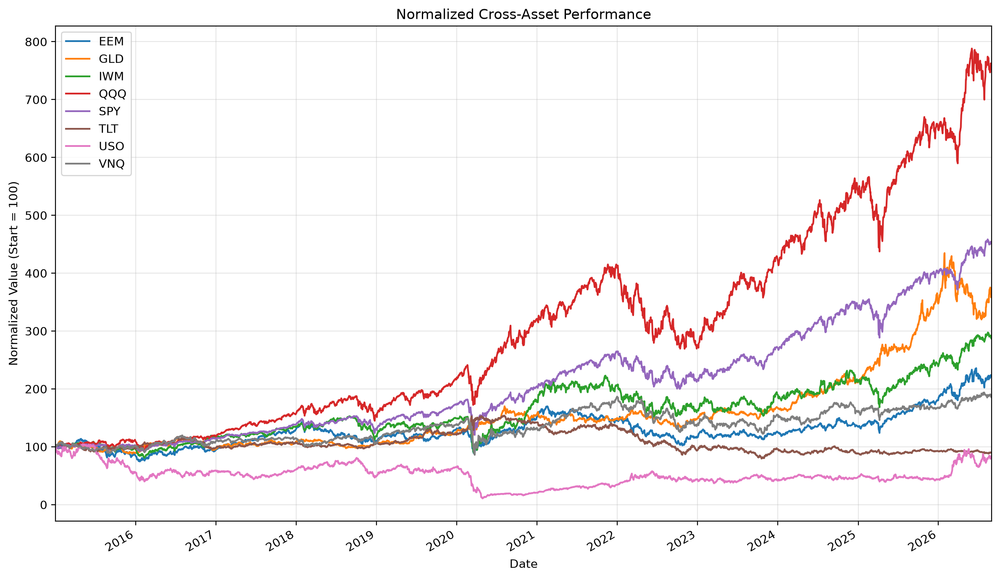
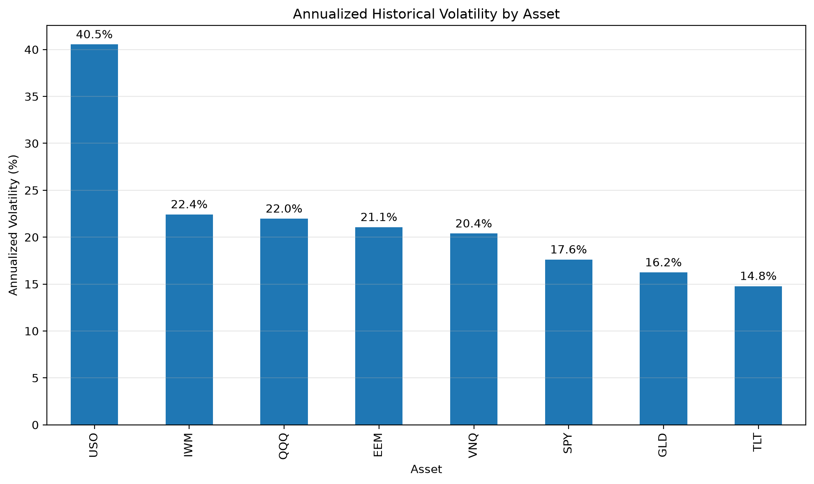
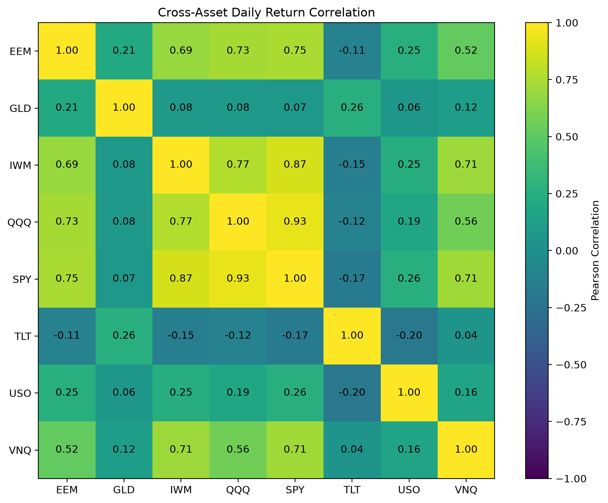
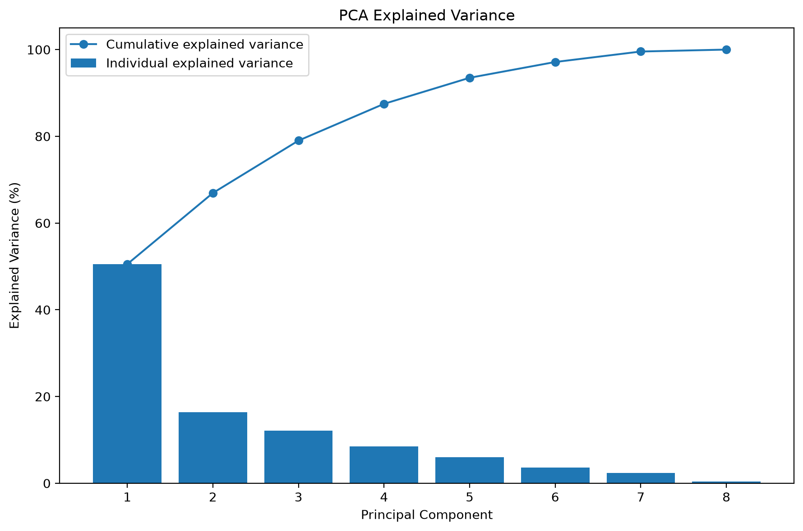
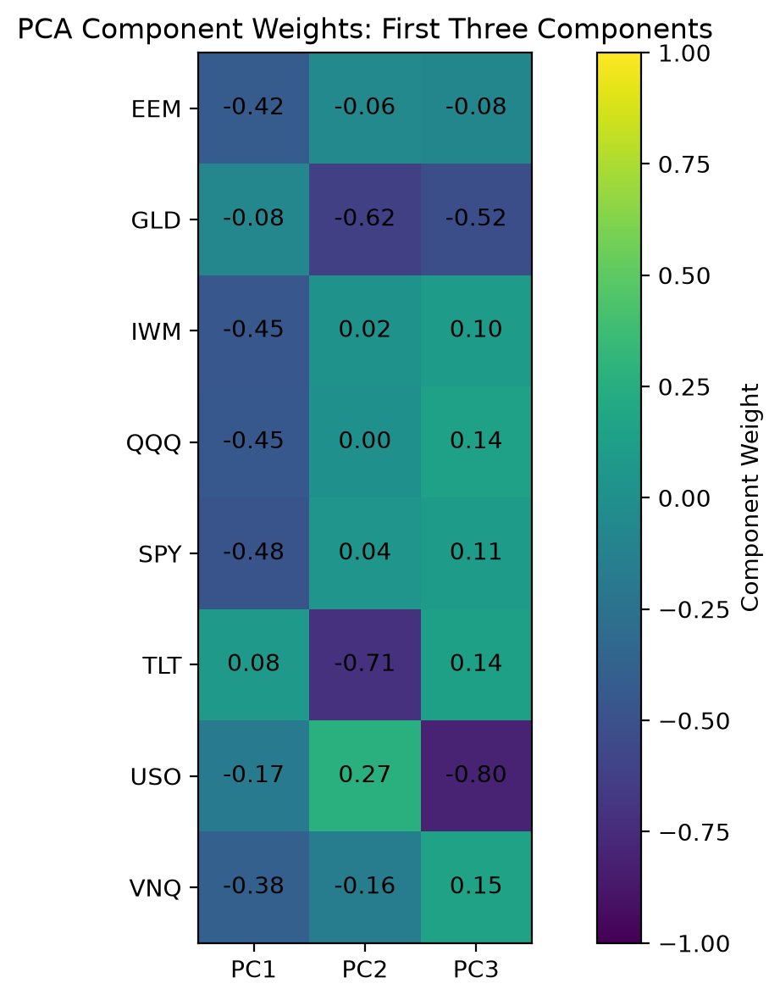

# Quant AI Market Lab

An ongoing quantitative research project exploring cross-asset market data through statistical analysis, numerical linear algebra, and reproducible computational methods, with planned extensions to machine learning and portfolio optimization.

> **Project Status:** Active development. The current repository contains the completed data, return-analysis, covariance, correlation, and Principal Component Analysis (PCA) stages. Regime modeling, predictive modeling, portfolio optimization, backtesting, explainability, and an interactive application are planned extensions.

## Motivation

This project develops an end-to-end quantitative research workflow from historical market data to mathematically formulated and computationally validated analysis.

The current stage focuses on understanding cross-asset return and risk structure before introducing predictive models or trading strategies. Mathematical formulations, algorithmic considerations, numerical validation, and limitations are documented alongside the implementation.

## Asset Universe

The analysis currently uses eight exchange-traded funds (ETFs) representing different market exposures:

- SPY — U.S. large-cap equities
- QQQ — Nasdaq-100 equities
- IWM — U.S. small-cap equities
- TLT — long-term U.S. Treasury bonds
- GLD — gold
- USO — oil-futures exposure
- EEM — emerging-market equities
- VNQ — U.S. real estate

The current historical sample covers 2015-01-01 through 2026-09-01.

## Completed Work

### 1. Market Data Pipeline

- Historical adjusted-price data acquisition
- Cross-asset dataset validation
- Missing-value and finite-value checks
- Local raw-data storage separated from version-controlled source code

### 2. Return Transformation

Both simple and logarithmic returns are computed and numerically validated.

For prices \(P_t\),

\[
R_t = \frac{P_t}{P_{t-1}} - 1,
\]

and

\[
r_t = \log\left(\frac{P_t}{P_{t-1}}\right).
\]

The implementation verifies the relationship

\[
r_t = \log(1+R_t)
\]

within numerical tolerance.

### 3. Exploratory Cross-Asset Analysis

Implemented analyses include:

- normalized historical asset performance
- annualized historical volatility
- cross-asset return correlations
- numerical validation of correlation-matrix properties







### 4. Covariance Analysis

The sample covariance matrix of log returns is constructed and numerically checked for symmetry and positive semidefinite structure.

For a portfolio-weight vector \(w\), portfolio return variance is represented by

\[
\operatorname{Var}(r_p)=w^\top\Sigma w.
\]

This covariance structure will later support portfolio-risk optimization.

### 5. Principal Component Analysis

PCA is applied to standardized cross-asset log returns to study dominant directions of historical co-movement.

In the current sample:

- PC1 explains approximately **50.53%** of standardized return variation.
- The first two components explain approximately **66.93%**.
- The first three components explain approximately **79.01%**.

The implementation validates eigenvector orthogonality, eigenvalue/trace consistency, and the explained-variance ratio.





The first component is interpreted cautiously as a broad equity/risk co-movement direction in this historical sample rather than as a causal economic factor.

## Mathematical and Algorithmic Documentation

The repository includes a dedicated technical document covering:

- data and return representations
- statistical estimators
- volatility and dependence measures
- covariance-matrix properties
- PCA formulation and eigendecomposition
- numerical validation
- computational complexity
- scalability considerations
- predictive-modeling and look-ahead-bias caveats

See:

`docs/mathematics_optimization_algorithms.md`

For example, covariance construction for \(T_R\) return observations and \(n\) assets scales approximately as

\[
O(T_R n^2),
\]

while a full dense eigendecomposition scales approximately as

\[
O(n^3).
\]

For the current eight-asset universe these computations are small, but the documentation discusses why algorithmic choices become more important as the asset universe grows.

## Repository Structure

```text
quant-ai-market-lab/
├── data/
│   ├── raw/          # local, ignored by Git
│   └── processed/    # local, ignored by Git
├── docs/
│   ├── mathematics_optimization_algorithms.md
│   └── references.md
├── models/           # local model artifacts
├── notebooks/
├── results/
├── src/
│   ├── download_data.py
│   ├── compute_returns.py
│   ├── exploratory_analysis.py
│   └── pca_analysis.py
├── .gitignore
├── README.md
└── requirements.txt
```

## Reproducibility

Development environment:

- Python 3.12
- Conda environment: `quant-ai`

The current Python dependency snapshot is stored in:

`requirements.txt`

Raw and processed market datasets are intentionally excluded from Git version control. The data-ingestion scripts provide the computational route for reconstructing the analysis dataset from the documented data source.

## Planned Development

The next research stages are:

1. market-regime detection using clustering and temporal latent-state models
2. volatility/risk prediction using statistical and machine-learning methods
3. model explainability
4. mathematically constrained portfolio optimization
5. time-aware backtesting and benchmark comparison
6. local generative-AI-assisted quantitative reporting
7. interactive Streamlit research dashboard

These components are **planned work and are not represented as completed results in the current repository**.

## Research and Validation Principles

The project emphasizes:

- mathematical formulation before implementation
- numerical validation of computed quantities
- explicit distinction between descriptive and predictive analysis
- prevention of look-ahead leakage in future predictive experiments
- computational-complexity and scalability analysis where relevant
- reproducible source code and version history
- transparent documentation of data sources, external methods, and limitations

## References and Attribution

Data sources, mathematical references, software documentation, and external methods used during development are recorded in:

`docs/references.md`

## Current Scope and Limitations

The current results are descriptive historical analyses and should not be interpreted as investment advice or evidence of a profitable trading strategy.

PCA currently uses the full historical sample and is therefore treated as descriptive analysis. Any future predictive or backtesting use of dimensionality reduction will require fitting transformations using only information available at the relevant historical time.
